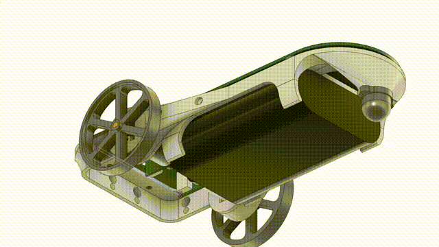

# Modular Autonomous Robot for Dynamic Environments

A lightweight autonomous robot for click-and-collect-style tasks developed for a KU Leuven project course.

It explores a maze-like environment, avoids obstacles, scans barcodes, and streams
telemetry data over a 2.4 GHz wireless link. 
<p align="center">
  
</p>

## What the system does

- **Dual-MCU architecture** — ESP32-S3 (FreeRTOS) handles navigation and motor
  control; PIC18F handles barcode scanning and telemetry relay.
- **Sensor** — 4× custom IR distance sensors, wheel encoders, and an MPU6050 IMU.
- **Control** — per-motor PID over PWM @ 35 kHz into an L293D H-bridge.
- **Navigation and Mapping** — Path finding with DFS and
  **A\*** algorithms.

## Contribution
Led the hardware and software design of the platform, with a focus on the communication modules and multi-sensor integration.

## What's in this repo

This repository contains the **PIC18F firmware** (barcode + nRF24 telemetry).
The ESP32-S3 navigation firmware lives elsewhere.

```
├── src/      # main.c, barcode_fsm.[ch], mirf.[ch] (nRF24 driver)
├── mcc/      # MPLAB Code Configurator project files
├── Makefile  # MPLAB X generated build script
└── assets/   # 3D-model preview GIF
```
---

*EE3 Integrated Project, KU Leuven, Group T — Mengge Zhang.
Full project report available on request.*
